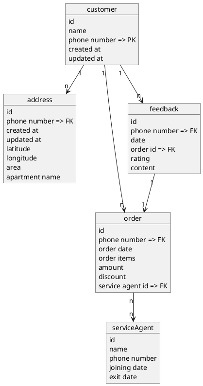

# tech-docs

## ER Diagram

```plantuml
@startuml
object customer
customer : id
customer : name
customer : phone number => PK
customer : created at
customer : updated at

object address
address : id
address : phone number => FK
address : created at
address : updated at
address : latitude
address : longitude
address : area
address : apartment name

object order
order : id
order : phone number => FK
order : order date
order : order items
order : amount
order : discount
order : service agent id => FK

object feedback
feedback : id
feedback : phone number => FK
feedback : date
feedback : order id => FK
feedback : rating
feedback : content

object serviceAgent
serviceAgent : id
serviceAgent : name
serviceAgent : phone number
serviceAgent : joining date
serviceAgent : exit date

customer "1" --> "n" address
customer "1" --> "n" order
customer "1" --> "n" feedback
feedback "1" --> "1" order
order "n" --> "n" serviceAgent
@enduml
```
